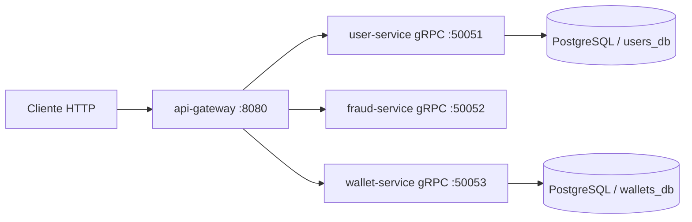

<p align="center">
  
</p>

<h1 align="center">Peer Ledger: Internal Wallet Transfers</h1>

<p align="center">
  Plataforma de microservicios para transferencias P2P internas con gateway HTTP y servicios gRPC desacoplados.
</p>

---

## Table of contents

- [Descripcion general](#descripcion-general)
- [Caracteristicas principales](#caracteristicas-principales)
- [Arquitectura del sistema](#arquitectura-del-sistema)
- [Flujo de una transferencia](#flujo-de-una-transferencia)
- [Estructura del proyecto](#estructura-del-proyecto)
- [Catalogo de microservicios](#catalogo-de-microservicios)
- [API publica del gateway](#api-publica-del-gateway)
- [Implementacion profesional de wallet-service](#implementacion-profesional-de-wallet-service)
- [Tests y cobertura](#tests-y-cobertura)
- [Guia de instalacion y ejecucion local](#guia-de-instalacion-y-ejecucion-local)
- [Variables de entorno](#variables-de-entorno)
- [Estado actual y roadmap](#estado-actual-y-roadmap)
- [Contribuciones](#contribuciones)
- [Licencia](#licencia)
- [Contacto](#contacto)

## Descripcion general

**Peer Ledger** es una wallet interna donde usuarios registrados se transfieren saldo entre si.

El cliente solo habla HTTP con `api-gateway`. El gateway orquesta llamadas gRPC a:

- `user-service` para validar sender/receiver
- `fraud-service` para reglas antifraude
- `wallet-service` para ejecutar la transferencia real en DB

`transaction-service` queda como siguiente fase para auditoria/historial.

## Caracteristicas principales

- Gateway como unico entrypoint HTTP.
- Comunicacion interna por gRPC.
- Validacion de usuarios con PostgreSQL (`users_db`).
- Antifraude en memoria con `sync.RWMutex`.
- Transferencia ACID en wallet con locking pesimista (`SELECT ... FOR UPDATE`).
- Idempotencia persistente en wallet (`idempotency_keys`).
- Manejo de dinero en centavos (`int64`) para evitar drift.
- Mapping consistente de errores gRPC -> HTTP.
- Graceful shutdown y conexion a DB con retry/backoff.
- Docker Compose local con migraciones.

## Arquitectura del sistema



## Flujo de una transferencia

1. Cliente envia `POST /transfers` con `sender_id`, `receiver_id`, `amount`, `idempotency_key`.
2. Gateway valida payload.
3. Gateway valida sender en `user-service`.
4. Gateway valida receiver en `user-service`.
5. Gateway evalua antifraude en `fraud-service`.
6. Si antifraude bloquea: responde `403` con `reason` y `rule_code`.
7. Si antifraude aprueba: llama `wallet.Transfer`.
8. Wallet ejecuta debito/credito en una sola transaccion ACID.
9. Gateway responde `200` con `transaction_id` y `sender_balance`.

## Estructura del proyecto

```text
peer-ledger-microservices-grpc/
|-- db/
|   `-- migrations/
|       |-- 01_users.sql
|       |-- 02_wallets.sql
|       `-- 03_transactions.sql
|-- gen/
|   |-- fraud/
|   |-- user/
|   |-- wallet/
|   `-- transaction/
|-- project/
|   |-- docker-compose.yml
|   `-- Makefile
|-- protobuf/
|   |-- fraud.proto
|   |-- user.proto
|   |-- wallet.proto
|   `-- transaction.proto
`-- services/
    |-- gateway/
    |-- user-service/
    |-- fraud-service/
    |-- wallet-service/
    `-- transaction-service/
```

## Catalogo de microservicios

### API Gateway

- Ruta: `services/gateway`
- Puerto: `8080`
- Rol:
  - entrypoint HTTP
  - orquestacion del flujo
  - traduccion de errores gRPC a HTTP

### User Service

- Ruta: `services/user-service`
- Puerto gRPC: `50051`
- Storage: PostgreSQL (`users_db`, tabla `users`)
- RPCs:
  - `GetUser`
  - `UserExists`

### Fraud Service

- Ruta: `services/fraud-service`
- Puerto gRPC: `50052`
- Storage: memoria (sin DB)
- RPC:
  - `EvaluateTransfer`
- Reglas:
  - `LIMIT_PER_TX`
  - `LIMIT_DAILY`
  - `LIMIT_VELOCITY`
  - `COOLDOWN_PAIR`
  - `IDEMPOTENCY_REUSED_MISMATCH`

### Wallet Service

- Ruta: `services/wallet-service`
- Puerto gRPC: `50053`
- Storage: PostgreSQL (`wallets_db`, tablas `wallets` + `idempotency_keys`)
- RPCs:
  - `GetBalance`
  - `Transfer`
- Garantias:
  - transaccion ACID
  - locking pesimista
  - control de fondos insuficientes
  - idempotencia persistente con deteccion de payload mismatch

## API publica del gateway

Base URL local: `http://localhost:8080`

### `GET /health`

Healthcheck del gateway.

### `GET /users/{userID}`

Proxy a `user-service:GetUser`.

### `GET /users/{userID}/exists`

Proxy a `user-service:UserExists`.

### `POST /transfers`

Ejemplo:

```bash
curl -X POST "http://localhost:8080/transfers" \
  -H "Content-Type: application/json" \
  -d '{
    "sender_id":"user-001",
    "receiver_id":"user-002",
    "amount":1000.01,
    "idempotency_key":"k1"
  }'
```

Respuesta exitosa (`200`):

```json
{
  "error": false,
  "message": "transfer executed successfully via wallet-service",
  "data": {
    "transaction_id": "2edbb5ab-8f18-49de-a6f2-2f9feeb96508",
    "sender_balance": 98999.99,
    "sender_id": "user-001",
    "receiver_id": "user-002",
    "amount": 1000.01
  }
}
```

Bloqueo por fraude (`403`):

```json
{
  "error": true,
  "message": "transfer blocked by fraud service",
  "data": {
    "reason": "cooldown active for sender-receiver pair",
    "rule_code": "COOLDOWN_PAIR"
  }
}
```

Fondos insuficientes (`409`):

```json
{
  "error": true,
  "message": "insufficient funds"
}
```

## Implementacion profesional de wallet-service

### Capa de config

- `Load()` y `LoadFromLookup()` para testabilidad.
- Validaciones estrictas de pool, timeouts y retries.
- Variables dedicadas de wallet en `.env.template`.

### Capa de DB

- `ConnectWithRetry(ctx, cfg)` con backoff exponencial.
- Pool tuning (`max open`, `max idle`, `lifetime`, `idle time`).
- Inyeccion de dependencias en conector (`OpenFunc`, `WaitFunc`) para tests.

### Capa repository (nucleo)

- `Transfer` con transaccion SQL real.
- Lock de sender/receiver con `FOR UPDATE`.
- Validacion de saldo previo a mutacion.
- Debito y credito atomicos.
- Generacion de `transaction_id` (UUID).
- Persistencia de resultado idempotente en `idempotency_keys.result`.
- Reintento idempotente devuelve resultado cacheado.
- Mismo key + payload distinto => `ErrIdempotencyPayloadMismatch`.

### Capa gRPC server

- Validacion de request de borde.
- Conversion `double -> int64` cents con redondeo consistente.
- Mapping de errores de dominio a `codes.*`.

### Integracion gateway

`POST /transfers` ahora ejecuta transferencia real en wallet.

Mapping wallet gRPC -> HTTP:

- `InvalidArgument` -> `400`
- `FailedPrecondition` -> `409`
- `NotFound` -> `404`
- `Unavailable` / `DeadlineExceeded` -> `503`
- fallback -> `502`

## Tests y cobertura

Se agregaron tests unitarios sin DB real para `wallet-service`:

- `internal/config`: defaults + validaciones
- `internal/db`: retry/backoff con mocks
- `internal/repository`: commit/rollback, idempotencia, conflicto `23505`, conversiones
- `internal/server`: mapeo gRPC y validaciones

Targets en `project/Makefile`:

```bash
make test-wallet
make test-wallet-cover
make test-wallet-cover-html
```

Artefactos de cobertura:

- `project/wallet.cover.out`
- `project/wallet.cover.html`

Cobertura total wallet (ultima corrida local):

- `58.4%`

## Guia de instalacion y ejecucion local

### Prerrequisitos

- Docker
- Docker Compose
- Go 1.25+

### 1) Clonar repo

```bash
git clone https://github.com/Lucascabral95/peer-ledger-microservices-grpc.git
cd peer-ledger-microservices-grpc
```

### 2) Configurar entorno

```bash
cp .env.template .env
```

### 3) Levantar stack

```bash
docker-compose -f project/docker-compose.yml up -d --build
```

### 4) Ver logs

```bash
docker-compose -f project/docker-compose.yml logs -f gateway user-service fraud-service wallet-service postgres
```

### 5) Bajar stack

```bash
docker-compose -f project/docker-compose.yml down
```

## Variables de entorno

Archivo de referencia: `.env.template`

### Gateway

- `PORT`
- `USER_SERVICE_GRPC_ADDR`
- `FRAUD_SERVICE_GRPC_ADDR`
- `WALLET_SERVICE_GRPC_ADDR`

### User Service

- `GRPC_PORT`
- `USER_DB_DSN`
- `DB_MAX_OPEN_CONNS`
- `DB_MAX_IDLE_CONNS`
- `DB_CONN_MAX_LIFETIME`
- `DB_CONN_MAX_IDLE_TIME`
- `DB_CONNECT_TIMEOUT`
- `DB_CONNECT_MAX_RETRIES`
- `DB_CONNECT_INITIAL_BACKOFF`
- `DB_CONNECT_MAX_BACKOFF`
- `GRACEFUL_SHUTDOWN_TIMEOUT`

### Fraud Service

- `FRAUD_GRPC_PORT`
- `FRAUD_PER_TX_LIMIT`
- `FRAUD_DAILY_LIMIT`
- `FRAUD_VELOCITY_MAX_COUNT`
- `FRAUD_VELOCITY_WINDOW`
- `FRAUD_PAIR_COOLDOWN`
- `FRAUD_IDEMPOTENCY_TTL`
- `FRAUD_TIMEZONE`
- `FRAUD_CLEANUP_INTERVAL`

### Wallet Service

- `WALLET_GRPC_PORT`
- `WALLET_DB_DSN`
- `WALLET_DB_MAX_OPEN_CONNS`
- `WALLET_DB_MAX_IDLE_CONNS`
- `WALLET_DB_CONN_MAX_LIFETIME`
- `WALLET_DB_CONN_MAX_IDLE_TIME`
- `WALLET_DB_CONNECT_TIMEOUT`
- `WALLET_DB_CONNECT_MAX_RETRIES`
- `WALLET_DB_CONNECT_INITIAL_BACKOFF`
- `WALLET_DB_CONNECT_MAX_BACKOFF`

### Postgres

- `POSTGRES_USER`
- `POSTGRES_PASSWORD`
- `POSTGRES_DB`

## Estado actual y roadmap

Completado:

- gateway + user-service + fraud-service integrados
- wallet-service implementado e integrado al flujo real
- idempotencia persistente en transferencias de wallet
- compose local con migraciones y entorno de pruebas

Siguiente fase:

- integrar `transaction-service` para auditoria/historial
- completar `GET /history/{userID}` en gateway
- ampliar tests de integracion end-to-end

## Contribuciones

Se aceptan PRs.

Convencion sugerida de commits:

- `feat:`
- `fix:`
- `docs:`
- `refactor:`
- `test:`
- `chore:`

## Licencia

MIT

## Contacto

- Autor: Lucas Cabral
- Email: lucassimple@hotmail.com
- LinkedIn: https://www.linkedin.com/in/lucas-gaston-cabral/
- GitHub: https://github.com/Lucascabral95
