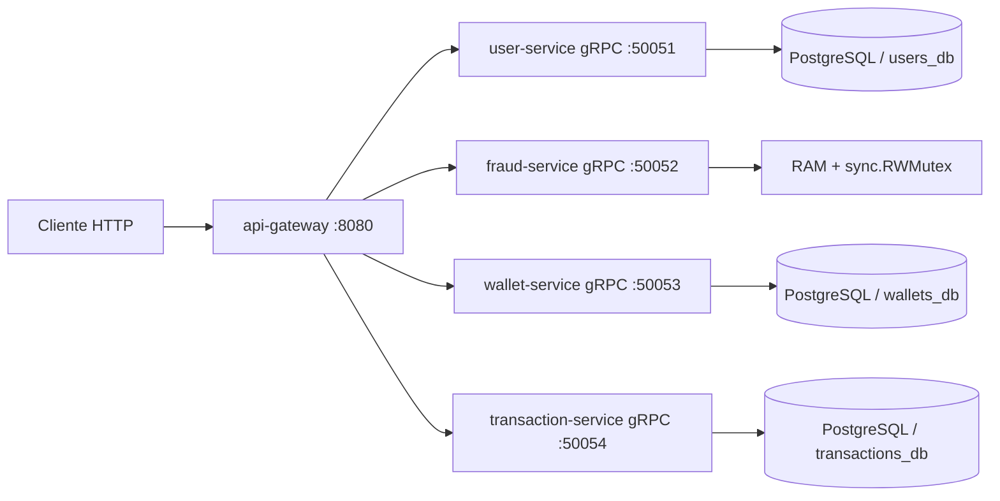

<p align="center">
  
</p>

<h1 align="center">Peer Ledger: Internal Wallet Transfers</h1>

<p align="center">
  Plataforma de microservicios para transferencias P2P internas con gateway HTTP, autenticacion JWT, servicios gRPC desacoplados, antifraude en memoria y persistencia transaccional en PostgreSQL.
</p>

---

## Table of contents

- [Descripción general](#descripcion-general)
- [Características principales](#caracteristicas-principales)
- [Estado actual del sistema](#estado-actual-del-sistema)
- [Arquitectura del sistema](#arquitectura-del-sistema)
- [Flujo completo de una transferencia](#flujo-completo-de-una-transferencia)
- [Estructura del proyecto](#estructura-del-proyecto)
- [Catálogo de microservicios](#catalogo-de-microservicios)
- [API pública del gateway](#api-publica-del-gateway)
- [Rate limiting del gateway](#rate-limiting-del-gateway)
- [Diseño técnico por servicio](#diseno-tecnico-por-servicio)
- [Testing y calidad](#testing-y-calidad)
- [CI](#ci)
- [Guía de instalación y ejecucion local](#guia-de-instalacion-y-ejecucion-local)
- [Variables de entorno](#variables-de-entorno)
- [Datos de prueba](#datos-de-prueba)
- [Estado actual y roadmap](#estado-actual-y-roadmap)
- [Contribuciones](#contribuciones)
- [Licencia](#licencia)
- [Contacto](#contacto)

## Descripcion general

**Peer Ledger** es una wallet interna donde usuarios registrados pueden transferirse saldo entre sí sin bancos, tarjetas ni integraciones externas.

El sistema sigue una arquitectura de microservicios con un único entrypoint HTTP:

- el cliente solo habla con `api-gateway`
- el gateway orquesta el flujo completo
- la comunicacion interna entre servicios es exclusivamente por gRPC
- cada servicio mantiene una responsabilidad bien acotada

Actualmente el flujo real ya esta implementado de punta a punta:

- registro de usuario
- login por email y password
- emision de JWT
- validacion de usuarios
- evaluacion antifraude
- ejecucion monetaria ACID en wallet
- registro de auditoria e historial

## Caracteristicas principales

- Gateway HTTP como unico punto de entrada.
- Comunicacion interna por gRPC entre servicios.
- `user-service` con PostgreSQL para usuarios, register y login.
- Autenticacion con JWT `HS256`.
- Middleware Bearer en rutas protegidas.
- `fraud-service` en memoria con reglas thread-safe.
- `wallet-service` con transferencias ACID e idempotencia persistente.
- `transaction-service` con auditoria e historial de movimientos.
- Conversion de dinero a centavos (`int64`) en borde de servicio para evitar drift.
- Mapping consistente de errores gRPC a HTTP.
- Rate limit por IP en `api-gateway`, con politica especial para `/transfers`.
- Configuracion estricta por variables de entorno.
- Graceful shutdown, retry/backoff y pool de conexiones.
- Docker Compose local con migraciones.
- CI con tests, validacion de compose y build de imagenes Docker.

## Estado actual del sistema

Servicios implementados e integrados:

- `api-gateway`
- `user-service`
- `fraud-service`
- `wallet-service`
- `transaction-service`

Flujo actual implementado:

1. `POST /auth/register` o `POST /auth/login`
2. gateway emite JWT
3. `POST /transfers` autenticado por Bearer token
4. gateway valida sender autenticado y receiver en `user-service`
5. gateway evalua reglas en `fraud-service`
6. gateway ejecuta la transferencia real en `wallet-service`
7. gateway registra auditoria en `transaction-service`
8. gateway responde `200` solo si wallet y auditoria terminan bien

Tambien esta expuesto:

- `GET /history/{userID}`
- `GET /users/{userID}`
- `GET /users/{userID}/exists`
- `GET /health`

## Arquitectura del sistema



Principio arquitectonico central:

- los servicios internos no se llaman entre si
- el gateway es el unico que conoce y orquesta el flujo completo
- el gateway valida JWT y deriva la identidad del sender desde el token

## Flujo completo de una transferencia

1. Cliente se registra o autentica en:
   - `POST /auth/register`
   - `POST /auth/login`
2. Gateway devuelve un JWT firmado (`HS256`).
3. Cliente envia `POST /transfers` con header:
   - `Authorization: Bearer <token>`
4. El body incluye:
   - `receiver_id`
   - `amount`
   - `idempotency_key`
5. Gateway toma `sender_id` desde el claim `sub` del JWT.
6. Gateway valida estructura y reglas basicas del payload.
7. Gateway verifica existencia del sender con `user-service`.
8. Gateway verifica existencia del receiver con `user-service`.
9. Gateway llama `fraud-service.EvaluateTransfer`.
10. Si fraude deniega:

- responde `403`
- incluye `reason` y `rule_code`

11. Si fraude aprueba:

- gateway llama `wallet-service.Transfer`

12. Wallet:

- bloquea wallets con `SELECT ... FOR UPDATE`
- valida saldo
- debita/acredita en una transaccion ACID
- persiste idempotencia
- devuelve `transaction_id` y `sender_balance`

13. Gateway llama `transaction-service.Record`
14. Transaction-service persiste:

- `transaction_id`
- sender
- receiver
- amount
- status
- `idempotency_key`

15. Si auditoria falla despues de wallet:

- gateway responde `500`
- el cliente debe reintentar con la misma `idempotency_key`

16. Si auditoria graba correctamente:

- gateway responde `200`

## Estructura del proyecto

```text
peer-ledger-microservices-grpc/
|-- .github/
|   `-- workflows/
|       `-- ci-cd.yml
|-- db/
|   `-- migrations/
|       |-- 01_users.sql
|       |-- 02_wallets.sql
|       `-- 03_transactions.sql
|-- gen/
|   |-- fraud/
|   |-- transaction/
|   |-- user/
|   `-- wallet/
|-- internal/
|   `-- security/
|-- project/
|   |-- docker-compose.yml
|   |-- Makefile
|   `-- scripts/
|-- protobuf/
|   |-- fraud.proto
|   |-- transaction.proto
|   |-- user.proto
|   `-- wallet.proto
`-- services/
    |-- gateway/
    |   |-- cmd/api
    |   `-- internal/
    |       |-- config/
    |       `-- middleware/
    |-- user-service/
    |-- fraud-service/
    |-- wallet-service/
    `-- transaction-service/
```

## Catalogo de microservicios

### API Gateway

- Ruta: `services/gateway`
- Puerto: `8080`
- Rol:
  - entrypoint HTTP
  - register y login
  - emision y validacion JWT
  - validacion de payloads
  - orquestacion del flujo
  - traduccion de errores gRPC a HTTP
  - rate limiting por IP

### User Service

- Ruta: `services/user-service`
- Puerto gRPC: `50051`
- Storage: PostgreSQL (`users_db`, tabla `users`)
- RPCs:
  - `GetUser`
  - `UserExists`
  - `Register`
  - `Login`
- Rol:
  - resolver si un usuario existe
  - obtener datos basicos del usuario
  - registrar usuarios
  - autenticar credenciales

### Fraud Service

- Ruta: `services/fraud-service`
- Puerto gRPC: `50052`
- Storage: memoria RAM
- RPC:
  - `EvaluateTransfer`
- Reglas implementadas:
  - `LIMIT_PER_TX`
  - `LIMIT_DAILY`
  - `LIMIT_VELOCITY`
  - `COOLDOWN_PAIR`
  - `IDEMPOTENCY_REUSED_MISMATCH`

### Wallet Service

- Ruta: `services/wallet-service`
- Puerto gRPC: `50053`
- Storage: PostgreSQL (`wallets_db`)
- Tablas:
  - `wallets`
  - `idempotency_keys`
- RPCs:
  - `GetBalance`
  - `Transfer`
- Garantias:
  - transaccion ACID
  - locking pesimista
  - fondos insuficientes
  - idempotencia persistente

### Transaction Service

- Ruta: `services/transaction-service`
- Puerto gRPC: `50054`
- Storage: PostgreSQL (`transactions_db`)
- Tabla:
  - `transactions`
- RPCs:
  - `Record`
  - `GetHistory`
- Rol:
  - auditoria
  - historial de movimientos
  - idempotencia de registro

## API publica del gateway

Base URL local:

```text
http://localhost:8080
```

### `GET /health`

Healthcheck del gateway.

### `POST /auth/register`

Registra un usuario y devuelve JWT.

```bash
curl -X POST "http://localhost:8080/auth/register" \
  -H "Content-Type: application/json" \
  -d '{
    "name":"Lucas",
    "email":"lucas+new@mail.com",
    "password":"Password123!"
  }'
```

### `POST /auth/login`

Autentica un usuario y devuelve JWT.

```bash
curl -X POST "http://localhost:8080/auth/login" \
  -H "Content-Type: application/json" \
  -d '{
    "email":"lucas@mail.com",
    "password":"Password123!"
  }'
```

### `GET /users/{userID}`

Proxy a `user-service:GetUser`.

### `GET /users/{userID}/exists`

Proxy a `user-service:UserExists`.

### `GET /history/{userID}`

Devuelve historial de movimientos del usuario autenticado.

```bash
curl "http://localhost:8080/history/user-001" \
  -H "Authorization: Bearer <token>"
```

### `POST /transfers`

```bash
curl -X POST "http://localhost:8080/transfers" \
  -H "Content-Type: application/json" \
  -H "Authorization: Bearer <token>" \
  -d '{
    "receiver_id":"user-002",
    "amount":1000.01,
    "idempotency_key":"k1"
  }'
```

Respuesta exitosa (`200`):

```json
{
  "error": false,
  "message": "transfer executed and recorded successfully",
  "data": {
    "transaction_id": "2edbb5ab-8f18-49de-a6f2-2f9feeb96508",
    "sender_balance": 98999.99,
    "sender_id": "user-001",
    "receiver_id": "user-002",
    "amount": 1000.01
  }
}
```

Bloqueo por fraude (`403`):

```json
{
  "error": true,
  "message": "transfer blocked by fraud service",
  "data": {
    "reason": "cooldown active for sender-receiver pair",
    "rule_code": "COOLDOWN_PAIR"
  }
}
```

Fondos insuficientes (`409`):

```json
{
  "error": true,
  "message": "insufficient funds"
}
```

Fallo al grabar auditoria despues de wallet (`500`):

```json
{
  "error": true,
  "message": "transfer executed in wallet-service but failed to record audit transaction",
  "data": {
    "transaction_id": "2edbb5ab-8f18-49de-a6f2-2f9feeb96508",
    "sender_balance": 98999.99,
    "stage": "transaction_recording",
    "retryable": true,
    "idempotency_key": "k1"
  }
}
```

## Rate limiting del gateway

El `api-gateway` implementa rate limit por IP mediante middleware interno.

Caracteristicas:

- middleware separado en `services/gateway/internal/middleware`
- configuracion por variables de entorno
- soporte para `trust proxy`
- headers:
  - `X-RateLimit-Limit`
  - `X-RateLimit-Remaining`
  - `X-RateLimit-Reset`
  - `Retry-After`
- policy especial para `/transfers`
- exclusiones configurables para probes

Politicas por default:

- rutas exentas:
  - `/health`
  - `/ping`
- `/transfers`:
  - `20` requests por `1m` por IP
- resto de rutas publicas:
  - `120` requests por `1m` por IP

Nota de arquitectura:

- el limiter actual es en memoria local
- es adecuado para portfolio, desarrollo y despliegue single-instance
- para produccion distribuida el siguiente paso natural es Redis

## Diseno tecnico por servicio

### Gateway

- config centralizada en `internal/config`
- retry gRPC configurable
- graceful shutdown HTTP
- auth con JWT `HS256`
- middleware Bearer para rutas protegidas
- middleware rate limiting reusable
- mapping consistente de gRPC a HTTP

### User Service

- config testeable
- conexion DB con pool y retry
- repository desacoplado
- server gRPC fino
- passwords hasheadas con PBKDF2-SHA256
- login por email y register con validacion fuerte

### Fraud Service

- estado en RAM protegido por `sync.RWMutex`
- reglas atomicas
- cache idempotente de decisiones
- janitor de limpieza periodica

### Wallet Service

- `Transfer` con transaccion SQL real
- lock de sender/receiver con `FOR UPDATE`
- debito/acredito atomico
- control de fondos insuficientes
- idempotencia persistente con deteccion de payload mismatch
- `transaction_id` generado y reutilizado en retries idempotentes

### Transaction Service

- persistencia de auditoria aislada
- `transaction_id` provisto por wallet
- idempotencia estricta por `idempotency_key`
- conflicto detectado por `transaction_id`
- lectura de historial ordenada por fecha

## Testing y calidad

El proyecto esta orientado a testing unitario con inyeccion de dependencias y mocks, evitando depender de una DB real para la mayor parte de la suite.

Cobertura fuerte actual:

- `user-service`
  - `config`
  - `db`
  - `repository`
  - `server`
  - `cmd/api` parcial
- `fraud-service`
  - `config`
  - `repository`
  - `server`
  - `cmd/api` parcial
- `wallet-service`
  - `config`
  - `db`
  - `repository`
  - `server`
- `transaction-service`
  - `config`
  - `db`
  - `repository`
  - `server`
  - `cmd/api` parcial
- `gateway`
  - `helpers`
  - `handlers`
  - `routes`
  - `main`
  - `internal/config`
  - `internal/middleware`
  - auth middleware

Targets disponibles en `project/Makefile`:

```bash
make test-user
make test-fraud
make test-wallet
make test-transaction
make test-gateway
make test-all
```

Cobertura HTML:

```bash
make test-user-cover
make test-fraud-cover
make test-wallet-cover
make test-transaction-cover
```

Nota sobre entorno local Windows:

- en algunas maquinas puede bloquearse la ejecucion de `*.test.exe` por App Control
- el repo ya tiene scripts para facilitar ejecucion local y CI
- GitHub Actions es la referencia confiable para validar la suite

## CI

Workflow:

- archivo: `.github/workflows/ci-cd.yml`

Jobs actuales:

- `test`
  - `go test ./...`
- `compose-validate`
  - valida `project/docker-compose.yml`
- `build-images`
  - construye imagenes Docker de:
    - `gateway`
    - `user-service`
    - `fraud-service`
    - `wallet-service`
    - `transaction-service`

El workflow no despliega; valida calidad y empaquetado.

## Guia de instalacion y ejecucion local

### Prerrequisitos

- Docker
- Docker Compose
- Go 1.25+

### 1) Clonar repo

```bash
git clone https://github.com/Lucascabral95/peer-ledger-microservices-grpc.git
cd peer-ledger-microservices-grpc
```

### 2) Configurar entorno

```bash
cp .env.template .env
```

Definir al menos:

- `AUTH_JWT_SECRET` con una clave real de 32+ caracteres
- credenciales de Postgres

### 3) Generar protobufs si hace falta

```bash
cd project
make proto
```

### 4) Levantar stack

```bash
docker compose -f project/docker-compose.yml up -d --build
```

### 5) Ver logs

```bash
docker compose -f project/docker-compose.yml logs -f gateway user-service fraud-service wallet-service transaction-service postgres
```

### 6) Bajar stack

```bash
docker compose -f project/docker-compose.yml down
```

## Variables de entorno

Archivo de referencia:

- `.env.template`

### Gateway

- `PORT`
- `USER_SERVICE_GRPC_ADDR`
- `FRAUD_SERVICE_GRPC_ADDR`
- `WALLET_SERVICE_GRPC_ADDR`
- `TRANSACTION_SERVICE_GRPC_ADDR`
- `AUTH_JWT_SECRET`
- `AUTH_JWT_ISSUER`
- `AUTH_JWT_TTL`
- `GATEWAY_GRPC_DIAL_TIMEOUT`
- `GATEWAY_GRPC_MAX_ATTEMPTS`
- `GATEWAY_RATE_LIMIT_ENABLED`
- `GATEWAY_RATE_LIMIT_DEFAULT_REQUESTS`
- `GATEWAY_RATE_LIMIT_DEFAULT_WINDOW`
- `GATEWAY_RATE_LIMIT_TRANSFERS_REQUESTS`
- `GATEWAY_RATE_LIMIT_TRANSFERS_WINDOW`
- `GATEWAY_RATE_LIMIT_CLEANUP_INTERVAL`
- `GATEWAY_RATE_LIMIT_TRUST_PROXY`
- `GATEWAY_RATE_LIMIT_EXEMPT_PATHS`
- `GATEWAY_GRACEFUL_SHUTDOWN_TIMEOUT`

### User Service

- `GRPC_PORT`
- `USER_DB_DSN`
- `USER_PASSWORD_HASH_ITERATIONS`
- `USER_PASSWORD_MIN_LENGTH`
- `DB_MAX_OPEN_CONNS`
- `DB_MAX_IDLE_CONNS`
- `DB_CONN_MAX_LIFETIME`
- `DB_CONN_MAX_IDLE_TIME`
- `DB_CONNECT_TIMEOUT`
- `DB_CONNECT_MAX_RETRIES`
- `DB_CONNECT_INITIAL_BACKOFF`
- `DB_CONNECT_MAX_BACKOFF`
- `GRACEFUL_SHUTDOWN_TIMEOUT`

### Fraud Service

- `FRAUD_GRPC_PORT`
- `FRAUD_PER_TX_LIMIT`
- `FRAUD_DAILY_LIMIT`
- `FRAUD_VELOCITY_MAX_COUNT`
- `FRAUD_VELOCITY_WINDOW`
- `FRAUD_PAIR_COOLDOWN`
- `FRAUD_IDEMPOTENCY_TTL`
- `FRAUD_TIMEZONE`
- `FRAUD_CLEANUP_INTERVAL`

### Wallet Service

- `WALLET_GRPC_PORT`
- `WALLET_DB_DSN`
- `WALLET_DB_MAX_OPEN_CONNS`
- `WALLET_DB_MAX_IDLE_CONNS`
- `WALLET_DB_CONN_MAX_LIFETIME`
- `WALLET_DB_CONN_MAX_IDLE_TIME`
- `WALLET_DB_CONNECT_TIMEOUT`
- `WALLET_DB_CONNECT_MAX_RETRIES`
- `WALLET_DB_CONNECT_INITIAL_BACKOFF`
- `WALLET_DB_CONNECT_MAX_BACKOFF`

### Transaction Service

- `TRANSACTION_GRPC_PORT`
- `TRANSACTION_DB_DSN`
- `TRANSACTION_DB_MAX_OPEN_CONNS`
- `TRANSACTION_DB_MAX_IDLE_CONNS`
- `TRANSACTION_DB_CONN_MAX_LIFETIME`
- `TRANSACTION_DB_CONN_MAX_IDLE_TIME`
- `TRANSACTION_DB_CONNECT_TIMEOUT`
- `TRANSACTION_DB_CONNECT_MAX_RETRIES`
- `TRANSACTION_DB_CONNECT_INITIAL_BACKOFF`
- `TRANSACTION_DB_CONNECT_MAX_BACKOFF`

### Postgres

- `POSTGRES_USER`
- `POSTGRES_PASSWORD`
- `POSTGRES_DB`

## Datos de prueba

Usuarios seeded por [`01_users.sql`](./db/migrations/01_users.sql):

- `lucas@mail.com` / `Password123!`
- `ana@mail.com` / `Password123!`
- `marcos@mail.com` / `Password123!`

Nota:

- si ya existia el volumen de Postgres, la migracion `01_users.sql` no se reaplica sola
- para recrear el schema con `password_hash`, ejecutar:

```bash
docker compose -f project/docker-compose.yml down -v
docker compose -f project/docker-compose.yml up -d --build
```

## Estado actual y roadmap

Completado:

- `gateway`, `user-service`, `fraud-service`, `wallet-service`, `transaction-service`
- auth con `register`, `login` y JWT
- flujo real de transferencia
- historial y auditoria
- idempotencia en wallet y transaction
- rate limit profesional en gateway
- Docker Compose local
- CI de tests y build de imagenes

Siguientes mejoras razonables:

- Redis para rate limiting distribuido
- observabilidad y metricas
- trazabilidad distribuida
- tests de integracion end-to-end automatizados
- paginacion de historial
- refresh tokens y rotacion de sesiones

## Contribuciones

Se aceptan PRs.

Convencion sugerida de commits:

- `feat:`
- `fix:`
- `docs:`
- `refactor:`
- `test:`
- `chore:`

## Licencia

MIT

## Contacto

- Autor: Lucas Cabral
- Email: lucassimple@hotmail.com
- LinkedIn: https://www.linkedin.com/in/lucas-gaston-cabral/
- GitHub: https://github.com/Lucascabral95
