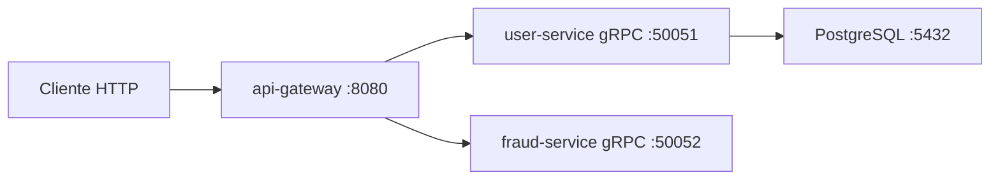

<p align="center">
  
</p>

<h1 align="center">Peer Ledger: Internal Wallet Transfers</h1>

<p align="center">
  Plataforma de microservicios para transferencias P2P internas, con validación de usuarios y motor antifraude en tiempo real vía gRPC.
</p>

---

## Table of contents

- [Descripción general](#descripción-general)
- [⚙️ Características principales](#️características-principales)
- [🏛️ Arquitectura del sistema](#️arquitectura-del-sistema)
- [Flujo de datos](#flujo-de-datos)
- [Estructura del proyecto](#estructura-del-proyecto)
- [🛠️ Catálogo de microservicios](#️catálogo-de-microservicios)
  - [🌐 API Gateway](#api-gateway)
  - [👤 User Service](#user-service)
  - [🛡️ Fraud Service](#fraud-service)
- [📡 API pública del gateway](#api-pública-del-gateway)
- [🧪 Guía de pruebas manuales](#guía-de-pruebas-manuales)
- [🚀 Guía de instalación y ejecución local](#guía-de-instalación-y-ejecución-local)
- [🔧 Variables de entorno](#variables-de-entorno)
- [📌 Estado actual y roadmap](#estado-actual-y-roadmap)
- [Contribuciones](#contribuciones)
- [Licencia](#licencia)
- [📬 Contacto](#contacto)

## Descripción general

**Peer Ledger** es una wallet interna de transferencias P2P basada en microservicios.  
El cliente solo se comunica con `api-gateway` por HTTP, y el gateway orquesta llamadas gRPC a servicios internos.

Actualmente el flujo de transferencias cubre:

- Validación de usuarios (`user-service`)
- Evaluación antifraude (`fraud-service`)
- Respuesta estructurada para aprobación o bloqueo

El diseño está orientado a:

- separación clara de responsabilidades
- componentes desacoplados
- arquitectura lista para extender con `wallet-service` y `transaction-service`

---

<a id="️características-principales"></a>

## ⚙️ Características principales

- Gateway como único entrypoint HTTP para clientes.
- Comunicación interna por gRPC entre servicios.
- Validación de usuarios por ID en `user-service` con PostgreSQL.
- Motor antifraude en memoria RAM con `sync.RWMutex` en `fraud-service`.
- Reglas de fraude configurables por variables de entorno.
- Idempotencia de fraude por `idempotency_key` para retries de red.
- Manejo de errores gRPC -> HTTP consistente en el gateway.
- Graceful shutdown en servicios gRPC.
- Docker Compose listo para levantar entorno local completo.

---

<a id="️arquitectura-del-sistema"></a>

## 🏛️ Arquitectura del sistema



## Flujo de datos

1. Cliente envía `POST /transfers` al gateway.
2. Gateway valida payload (`sender_id`, `receiver_id`, `amount`, `idempotency_key`).
3. Gateway llama a `user-service` para verificar sender y receiver.
4. Gateway llama a `fraud-service` para `EvaluateTransfer`.
5. Si fraude bloquea, gateway responde `403` con `reason` y `rule_code`.
6. Si fraude aprueba, gateway responde `202` (hook listo para wallet/transaction).

## Estructura del proyecto

```text
peer-ledger-microservices-grpc/
├── db/
│   └── migrations/
│       ├── 01_users.sql
│       ├── 02_wallets.sql
│       └── 03_transactions.sql
├── gen/
│   ├── fraud/
│   ├── user/
│   ├── wallet/
│   └── transaction/
├── project/
│   ├── docker-compose.yml
│   └── Makefile
├── protobuf/
│   ├── fraud.proto
│   ├── user.proto
│   ├── wallet.proto
│   └── transaction.proto
└── services/
    ├── gateway/
    ├── user-service/
    ├── fraud-service/
    ├── wallet-service/        # pendiente de implementación funcional
    └── transaction-service/   # pendiente de implementación funcional
```

<a id="️catálogo-de-microservicios"></a>

## 🛠️ Catálogo de microservicios

<a id="api-gateway"></a>

### 🌐 API Gateway

- **Ruta**: `services/gateway`
- **Puerto**: `8080`
- **Rol**:
  - entrypoint HTTP
  - orquestación del flujo de transferencias
  - traducción de errores gRPC a HTTP

<a id="user-service"></a>

### 👤 User Service

- **Ruta**: `services/user-service`
- **Puerto gRPC**: `50051`
- **Storage**: PostgreSQL (`users_db`, tabla `users`)
- **RPCs**:
  - `GetUser`
  - `UserExists`

<a id="fraud-service"></a>

### 🛡️ Fraud Service

- **Ruta**: `services/fraud-service`
- **Puerto gRPC**: `50052`
- **Storage**: memoria RAM (sin DB)
- **RPC**:
  - `EvaluateTransfer`
- **Reglas activas**:
  - `LIMIT_PER_TX`
  - `LIMIT_DAILY`
  - `LIMIT_VELOCITY`
  - `COOLDOWN_PAIR`
  - `IDEMPOTENCY_REUSED_MISMATCH`

## 📡 API pública del gateway

Base URL local: `http://localhost:8080`

### `GET /health`

Healthcheck del gateway.

### `GET /users/{userID}`

Proxy gRPC a `user-service:GetUser`.

### `GET /users/{userID}/exists`

Proxy gRPC a `user-service:UserExists`.

### `POST /transfers`

Ejemplo:

```bash
curl -X POST "http://localhost:8080/transfers" \
  -H "Content-Type: application/json" \
  -d '{
    "sender_id":"user-001",
    "receiver_id":"user-002",
    "amount":1000.01,
    "idempotency_key":"k1"
  }'
```

Respuesta de bloqueo por fraude:

```json
{
  "error": true,
  "message": "transfer blocked by fraud service",
  "data": {
    "reason": "cooldown active for sender-receiver pair",
    "rule_code": "COOLDOWN_PAIR"
  }
}
```

Respuesta de aprobación actual:

```json
{
  "error": false,
  "message": "users validated and fraud approved via gRPC; next step is wallet/transaction orchestration",
  "data": {
    "sender_id": "user-001",
    "receiver_id": "user-002",
    "amount": 1000.01,
    "idempotency_key": "k1"
  }
}
```

## 🧪 Guía de pruebas manuales

### 1) Health del gateway

```bash
curl http://localhost:8080/health
```

### 2) Obtener usuario

```bash
curl http://localhost:8080/users/user-001
```

### 3) Verificar existencia

```bash
curl http://localhost:8080/users/user-001/exists
```

### 4) Probar límites de fraude

Importante para todas las pruebas:

- Usá `idempotency_key` distinto en cada intento, salvo en la prueba de idempotencia.
- Si repetís el mismo key con el mismo payload, fraude devuelve decisión cacheada.

#### `LIMIT_PER_TX`

Condición: monto mayor a `20000`.

```bash
curl -X POST "http://localhost:8080/transfers" \
  -H "Content-Type: application/json" \
  -d '{"sender_id":"user-001","receiver_id":"user-002","amount":20000.01,"idempotency_key":"per-tx-1"}'
```

Esperado: `403` con `rule_code = LIMIT_PER_TX`.

#### `COOLDOWN_PAIR`

Condición: mismo par `sender->receiver` en menos de `30s` con distinto key.

```bash
# 1) primera request (deberia aprobar)
curl -X POST "http://localhost:8080/transfers" \
  -H "Content-Type: application/json" \
  -d '{"sender_id":"user-001","receiver_id":"user-002","amount":1000,"idempotency_key":"cooldown-1"}'

# 2) segunda request inmediata (deberia bloquear)
curl -X POST "http://localhost:8080/transfers" \
  -H "Content-Type: application/json" \
  -d '{"sender_id":"user-001","receiver_id":"user-002","amount":1000,"idempotency_key":"cooldown-2"}'
```

Esperado en la segunda: `403` con `rule_code = COOLDOWN_PAIR`.

#### `LIMIT_VELOCITY`

Condición: más de 5 transferencias en ventana de 10 minutos por el mismo `sender`.

- Enviá 6 requests rápidas con distintos `idempotency_key`.
- Ejemplo de keys: `vel-1`, `vel-2`, `vel-3`, `vel-4`, `vel-5`, `vel-6`.

Esperado: la 6ta devuelve `403` con `rule_code = LIMIT_VELOCITY`.

#### `LIMIT_DAILY`

Condición: acumulado diario del sender supera `50000`.

- Ejemplo: 5 requests de `10000` y luego 1 request de `1`.

Esperado en la que excede: `403` con `rule_code = LIMIT_DAILY`.

#### `IDEMPOTENCY_REUSED_MISMATCH`

Condición: mismo `idempotency_key` pero payload diferente.

```bash
# 1) request base
curl -X POST "http://localhost:8080/transfers" \
  -H "Content-Type: application/json" \
  -d '{"sender_id":"user-001","receiver_id":"user-002","amount":1000,"idempotency_key":"idem-mismatch-1"}'

# 2) mismo key, cambia amount
curl -X POST "http://localhost:8080/transfers" \
  -H "Content-Type: application/json" \
  -d '{"sender_id":"user-001","receiver_id":"user-002","amount":1200,"idempotency_key":"idem-mismatch-1"}'
```

Esperado en la segunda: `403` con `rule_code = IDEMPOTENCY_REUSED_MISMATCH`.

## 🚀 Guía de instalación y ejecución local

### Prerrequisitos

- Docker
- Docker Compose
- Go 1.25+ (si ejecutás binarios fuera de contenedores)

### 1) Clonar repositorio

```bash
git clone https://github.com/Lucascabral95/peer-ledger-microservices-grpc.git
cd peer-ledger-microservices-grpc
```

### 2) Configurar entorno

```bash
cp .env.template .env
```

### 3) Levantar stack local

```bash
docker-compose -f project/docker-compose.yml up -d --build
```

### 4) Ver logs

```bash
docker-compose -f project/docker-compose.yml logs -f gateway user-service fraud-service postgres
```

### 5) Bajar servicios

```bash
docker-compose -f project/docker-compose.yml down
```

## 🔧 Variables de entorno

Archivo de referencia: `.env.template`

### Gateway

- `PORT`
- `USER_SERVICE_GRPC_ADDR`
- `FRAUD_SERVICE_GRPC_ADDR`

### User Service

- `GRPC_PORT`
- `USER_DB_DSN`
- `DB_MAX_OPEN_CONNS`
- `DB_MAX_IDLE_CONNS`
- `DB_CONN_MAX_LIFETIME`
- `DB_CONN_MAX_IDLE_TIME`
- `DB_CONNECT_TIMEOUT`
- `DB_CONNECT_MAX_RETRIES`
- `DB_CONNECT_INITIAL_BACKOFF`
- `DB_CONNECT_MAX_BACKOFF`
- `GRACEFUL_SHUTDOWN_TIMEOUT`

### Fraud Service

- `FRAUD_GRPC_PORT`
- `FRAUD_PER_TX_LIMIT`
- `FRAUD_DAILY_LIMIT`
- `FRAUD_VELOCITY_MAX_COUNT`
- `FRAUD_VELOCITY_WINDOW`
- `FRAUD_PAIR_COOLDOWN`
- `FRAUD_IDEMPOTENCY_TTL`
- `FRAUD_TIMEZONE`
- `FRAUD_CLEANUP_INTERVAL`

### Postgres

- `POSTGRES_USER`
- `POSTGRES_PASSWORD`
- `POSTGRES_DB`

## 📌 Estado actual y roadmap

Completado:

- gateway + user-service + fraud-service integrados
- compose local con migraciones de DB
- reglas antifraude product-ready para entorno local

Siguiente fase:

- `wallet-service` con transacción ACID e idempotencia persistente
- `transaction-service` para auditoría e historial
- integración completa del flujo con `transaction_id` final

## Contribuciones

Contribuciones y PRs son bienvenidos.

Convención sugerida de commits:

- `feat:`
- `fix:`
- `docs:`
- `refactor:`
- `test:`
- `chore:`

## Licencia

MIT

## 📬 Contacto

- **Autor**: Lucas Cabral
- **Email**: lucassimple@hotmail.com
- **LinkedIn**: https://www.linkedin.com/in/lucas-gastón-cabral/
- **GitHub**: https://github.com/Lucascabral95
