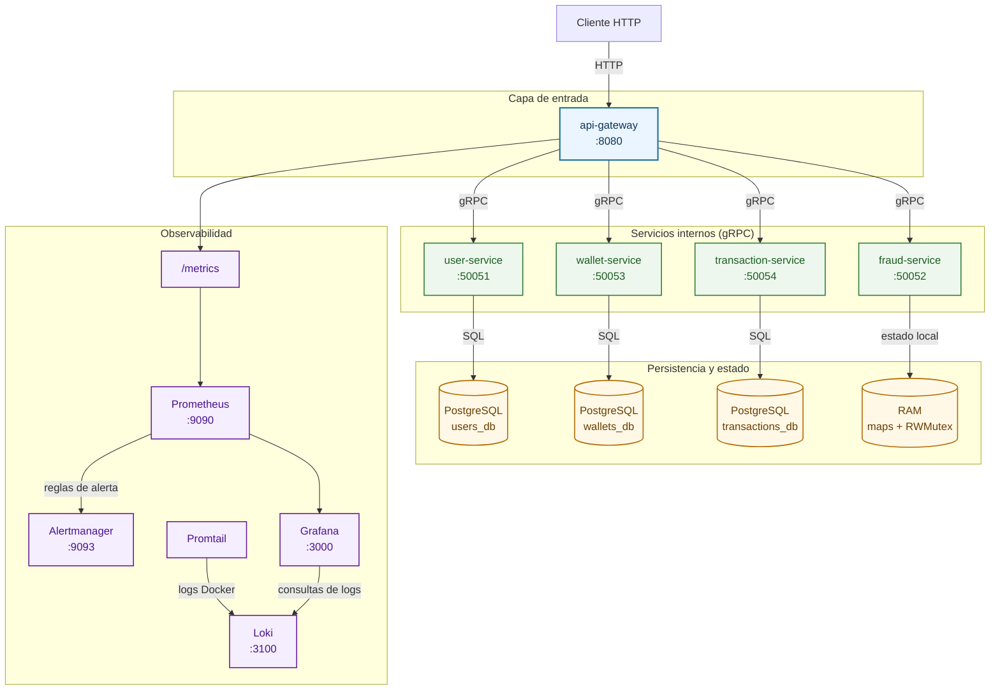
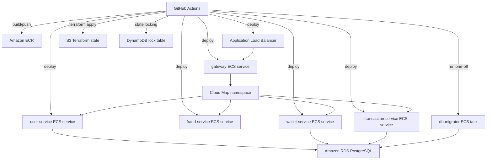
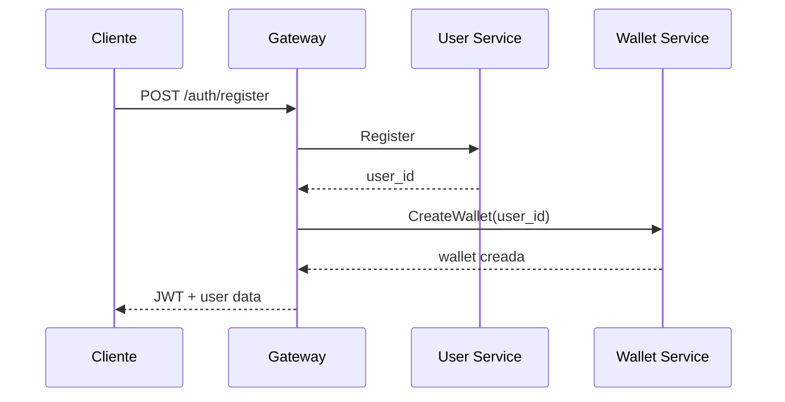
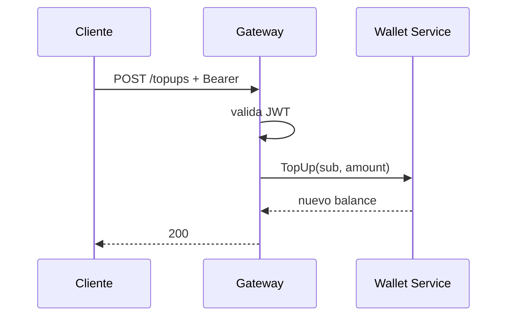
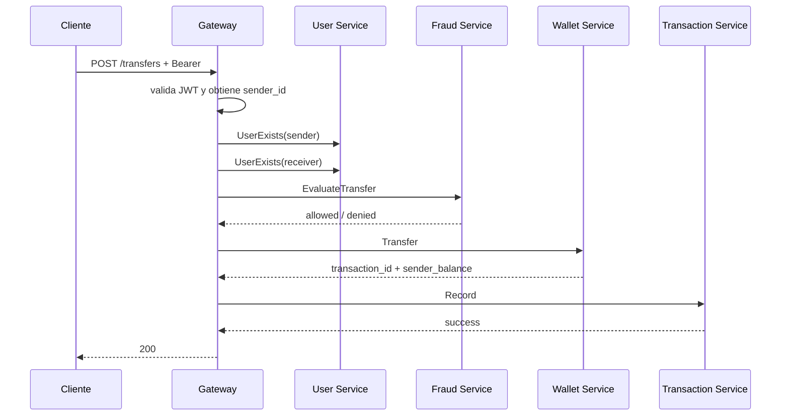

# Arquitectura

## Proposito

`Peer Ledger` implementa una plataforma de transferencias internas entre usuarios registrados. El sistema separa autenticacion, validacion, antifraude, ejecucion monetaria y auditoria para mantener responsabilidades acotadas, facilitar testing y reducir acoplamiento entre componentes.

Objetivos principales:

- un unico entrypoint HTTP
- contratos internos tipados por gRPC
- consistencia monetaria fuerte en `wallet-service`
- auditoria desacoplada
- base operativa con metricas desde el gateway

## Diagrama de arquitectura

  <strong>Topologia general del sistema</strong>

## Topologia de despliegue AWS

La plataforma se despliega en AWS con dos stacks Terraform operativos:

- `platform`: red, balanceo, runtime compartido y base de datos
- `services`: workloads ECS y migraciones operativas

### Responsabilidad por stack

#### `foundation`

- repositorios ECR
- secrets en Secrets Manager
- rol IAM/OIDC para GitHub Actions

#### `platform`

- VPC y subnets publicas/privadas
- Internet Gateway y NAT Gateway
- security groups
- ALB, listener y target group del gateway
- ECS cluster
- Cloud Map namespace privado
- RDS PostgreSQL
- log groups de CloudWatch

#### `services`

- task definitions
- ECS services del gateway e internos
- autoscaling policies
- task definition de `db-migrator`
- ejecucion one-off del `db-migrator` durante `terraform apply`

## Principios arquitectonicos

### 1. Gateway como orquestador unico

El `api-gateway` es el unico componente que conoce el flujo completo de negocio.

Consecuencias:

- el cliente solo habla con el gateway
- los servicios internos no se llaman entre si
- el gateway compone el caso de uso y traduce errores tecnicos a respuestas HTTP

### 2. Responsabilidades acotadas

Cada servicio tiene un objetivo principal:

- `user-service`: identidad, register, login y resolucion de usuarios
- `fraud-service`: decision previa de fraude
- `wallet-service`: mutacion monetaria real
- `transaction-service`: auditoria e historial
- `api-gateway`: autenticacion HTTP, middlewares y orquestacion

### 3. Storage independiente por servicio

Servicios con persistencia:

- `user-service` -> `users_db`
- `wallet-service` -> `wallets_db`
- `transaction-service` -> `transactions_db`

Servicios sin base:

- `fraud-service` -> estado en RAM
- `api-gateway` -> sin base propia

Esto evita que varios servicios compartan tablas de forma directa.

### 4. Correccion monetaria primero

Los importes se convierten a centavos (`int64`) dentro del dominio y las operaciones monetarias no se realizan con `float`.

Beneficios:

- evita drift por precision binaria
- simplifica sumas y comparaciones
- mantiene el comportamiento consistente entre servicios

## Vista por servicio

## `api-gateway`

### Responsabilidades

- expone la API HTTP publica
- valida JWT Bearer
- deriva el `sender_id` desde el claim `sub`
- aplica rate limiting por IP
- expone metricas Prometheus
- mapea errores gRPC a HTTP
- orquesta `register`, `login`, `topup`, `transfer` y `history`

### Rutas publicas actuales

- `GET /health`
- `GET /ping`
- `GET /metrics`
- `POST /auth/register`
- `POST /auth/login`
- `GET /users/{userID}`
- `GET /users/{userID}/exists`
- `GET /history/{userID}`
- `POST /topups`
- `POST /transfers`

### Seguridad

Decision central:

- en `POST /transfers`, el `sender_id` no llega en el body
- el gateway lo obtiene desde el JWT

Eso evita que el cliente intente transferir en nombre de otro usuario.

### Rate limiting

Politicas actuales por default:

- `/transfers`: `20` requests por `1m` por IP
- resto de rutas: `120` requests por `1m` por IP
- exentas: `/health`, `/ping`, `/metrics`

Tradeoff:

- valido para entorno local y despliegue single-instance
- no comparte estado entre replicas
- para produccion multi-instancia el siguiente paso razonable es Redis

## Orquestacion de despliegue

### Orden operativo

El despliegue cloud estable requiere este orden:

1. `bootstrap`
2. `foundation`
3. `platform`
4. `services`

En el `Makefile`:

- `tf-up` ejecuta `platform` y despues `services`
- `tf-down` destruye `services` y despues `platform`

Ese orden es obligatorio porque `services` consume remote state de `platform` y `foundation`.

### Resolucion de imagenes

La capa `services` recibe `service_images` como `map(string)` con estas claves obligatorias:

- `gateway`
- `user-service`
- `fraud-service`
- `wallet-service`
- `transaction-service`
- `db-migrator`

Localmente y en CI/CD ese mapa se genera en `infra/services/service-images.auto.tfvars.json` desde scripts bash, en lugar de pasar JSON inline al CLI de Terraform.

### Migraciones de base de datos

`db-migrator` corre como una ECS task Fargate one-off durante `terraform apply` de `services`.

Secuencia:

1. Terraform registra la task definition del migrator
2. Terraform ejecuta `run-db-migrator.sh`
3. la task conecta a RDS y aplica migraciones
4. si el exit code no es `0`, el apply falla
5. si el migrator termina bien, ECS estabiliza `user-service`, `wallet-service` y `transaction-service`

Esto reduce el riesgo de arrancar servicios que dependan de tablas inexistentes.

### Observabilidad

Metricas del gateway:

- `gateway_http_requests_total`
- `gateway_http_request_duration_seconds`

Labels:

- `method`
- `route`
- `status`

Prometheus scrapea `/metrics` y Grafana consume esas series para el dashboard operativo del gateway.
Prometheus evalua reglas y envia alertas a Alertmanager para notificaciones por email.
Promtail recolecta logs de contenedores Docker y los envia a Loki, que Grafana usa para explorar logs.

## `user-service`

### Responsabilidades

- registrar usuarios
- autenticar credenciales
- obtener usuario por ID
- verificar existencia

### Persistencia

Tabla `users` en `users_db`.

Campos principales:

- `id`
- `name`
- `email`
- `password_hash`
- `created_at`

### Manejo de credenciales

Las passwords se almacenan hasheadas con PBKDF2-SHA256.

Decision:

- el servicio autentica, pero no emite JWT
- el gateway emite el token despues de un `login` o `register` exitoso

Esto mantiene el manejo del token en el borde HTTP y reduce acoplamiento del servicio de usuarios con concerns de transporte.

## `fraud-service`

### Responsabilidades

- evaluar si una transferencia puede ejecutarse antes de tocar dinero

### Modelo de estado

Todo el estado vive en memoria:

- acumulados diarios
- ventanas de velocidad
- cooldown por par
- cache de decisiones idempotentes

### Reglas implementadas

- limite por transaccion
- limite diario por sender
- limite de velocidad
- cooldown direccional `A -> B`
- mismatch de `idempotency_key`

### Tradeoff

Si el servicio reinicia, el estado antifraude se pierde.

Esto fue una decision deliberada para mantener el servicio simple y demostrar:

- concurrencia segura
- evaluacion atomica
- separacion entre chequeo preventivo y mutacion monetaria

## `wallet-service`

### Responsabilidades

- crear wallet inicial
- recargar saldo
- ejecutar transferencias reales

### Persistencia

`wallets_db` con tablas:

- `wallets`
- `idempotency_keys`

### Modelo de ejecucion monetaria

La operacion `Transfer` realiza:

1. validacion de input
2. chequeo de idempotencia
3. inicio de transaccion SQL
4. bloqueo de wallets involucradas con `SELECT ... FOR UPDATE`
5. verificacion de saldo suficiente
6. debito y credito atomicos
7. persistencia del resultado idempotente
8. commit

### Por que locking pesimista

Se eligio `FOR UPDATE` para evitar:

- doble gasto
- saldo negativo bajo concurrencia
- condiciones de carrera en requests simultaneas

### Idempotencia

Si llega la misma `idempotency_key`:

- mismo payload -> devuelve el resultado anterior
- distinto payload -> error de mismatch

Esto permite retries seguros sin duplicar debitos o creditos.

### Provision de wallet

Cuando un usuario se registra:

1. el gateway crea el usuario en `user-service`
2. el gateway crea la wallet inicial en `wallet-service`
3. el gateway emite JWT

La provision ocurre en el gateway para preservar la regla de no permitir llamadas directas entre servicios internos.

## `transaction-service`

### Responsabilidades

- registrar auditoria de cada transferencia aprobada
- exponer historial por usuario

### Persistencia

Tabla `transactions` en `transactions_db`.

Campos relevantes:

- `id` (`transaction_id`)
- `sender_id`
- `receiver_id`
- `amount`
- `status`
- `idempotency_key`
- `created_at`

### Modelo de idempotencia

`Record` aplica idempotencia estricta:

- misma key + mismo payload -> exito sin duplicar fila
- misma key + distinto payload -> error

### Por que auditoria separada

Separar auditoria de wallet evita mezclar:

- mutacion monetaria critica
- concerns de lectura e historial
- evolucion futura de reporting

Tradeoff actual:

- si wallet confirma pero `transaction-service` falla, el dinero ya se movio
- el gateway responde `500` retryable
- el cliente debe reintentar con la misma `idempotency_key`

## Flujos principales

## Registro

## Top up

## Transferencia

## Estrategia ante fallos

### Fraude denegado

- `fraud-service` corta antes de tocar dinero
- el gateway responde `403`

### Fondos insuficientes

- `wallet-service` responde error de precondicion
- el gateway responde `409`

### Falla de auditoria despues de wallet

- el dinero ya fue movido por wallet
- el gateway responde `500` con `retryable=true`
- el cliente debe reintentar con la misma `idempotency_key`

Eso evita reejecutar el debito/acredito por el modelo idempotente del wallet.

## Decisiones tecnologicas

### Por que gRPC internamente

- define contratos formales con `proto`
- reduce ambiguedad en payloads internos
- simplifica compatibilidad tipada entre servicios

### Por que PostgreSQL

- soporta transacciones ACID
- permite locking pesimista
- maneja constraints e indices de forma robusta

### Por que Prometheus + Grafana

- permiten medir throughput y latencia del gateway
- facilitan detectar errores HTTP por ruta y status
- elevan el proyecto a una base operativa mas profesional

Hoy la observabilidad cubre el gateway. El siguiente paso es instrumentar tambien los servicios internos.

## Estrategia de testing

El proyecto prioriza tests unitarios desacoplados de infraestructura real.

Patrones aplicados:

- configuraciones testeables por lookup injection
- conectores DB con `OpenFunc` y `WaitFunc`
- repositories con interfaces mockeables
- servers gRPC con stores falsos
- gateway con clientes gRPC mockeados

Esto permite validar gran parte del comportamiento sin levantar Postgres ni servicios externos.

## Limitaciones conocidas

- el rate limit es local a una instancia
- el antifraude no persiste estado ante restart
- no hay tracing distribuido todavia
- la auditoria es sincronica y no usa cola/event bus
- no hay refresh tokens
- `GET /history` todavia no pagina

## Camino de evolucion

1. instrumentar `user`, `fraud`, `wallet` y `transaction-service`
2. agregar tracing distribuido
3. mover rate limiting a Redis en despliegues multi-instancia
4. sumar tests end-to-end
5. introducir refresh tokens y manejo de sesiones
